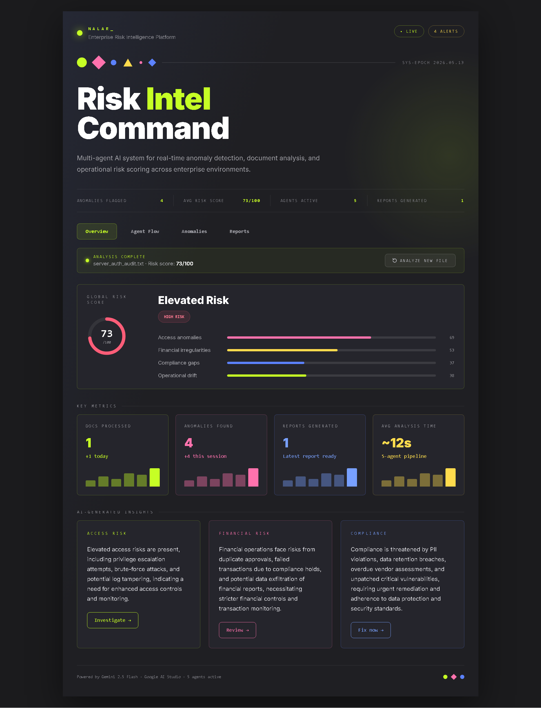
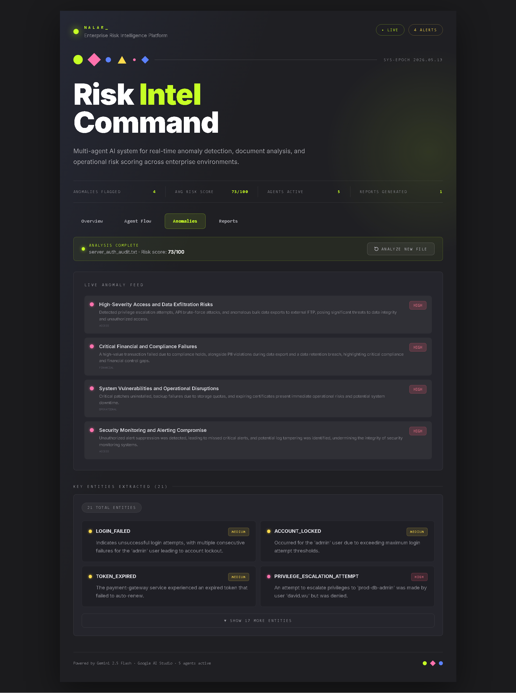
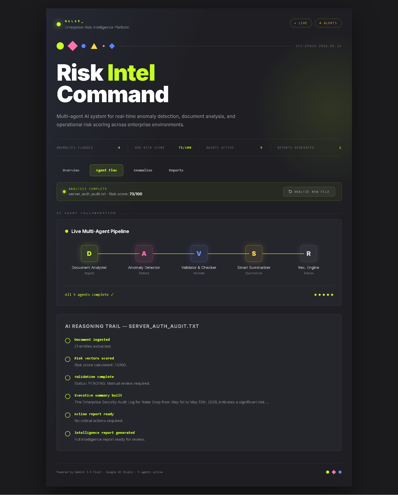

# NALAR_

> Enterprise Risk Intelligence Platform powered by Multi-Agent AI Orchestration

NALAR_ is an AI-powered enterprise intelligence platform designed for real-time anomaly detection, document analysis, compliance monitoring, and operational risk scoring through a coordinated multi-agent pipeline architecture.

Built to simulate enterprise-grade cyber risk analysis workflows, NALAR_ combines modern AI orchestration with a futuristic intelligence dashboard experience.

---

## Live Demo

### Frontend
https://nalar-chi.vercel.app

### Backend API
https://nalar-backend-production-b6b2.up.railway.app/docs

---

# Overview

NALAR_ analyzes uploaded enterprise documents such as:
- security audit logs
- compliance reports
- financial operation records
- operational system logs
- structured enterprise data

The platform processes documents through a coordinated 5-agent AI pipeline to generate:
- enterprise risk scoring
- anomaly detection
- compliance insights
- operational intelligence
- remediation recommendations

---

# Core Features

- Multi-agent AI orchestration pipeline
- Real-time enterprise risk scoring
- AI-powered anomaly detection
- Financial irregularity analysis
- Compliance & governance assessment
- Operational drift monitoring
- Intelligent remediation recommendations
- Enterprise dashboard visualization
- File upload & automated parsing
- FastAPI + Next.js architecture
- Railway & Vercel cloud deployment

---

# Multi-Agent Intelligence Pipeline

NALAR_ uses a collaborative 5-agent orchestration system:

| Agent | Responsibility |
|---|---|
| Document Analyzer | Extracts structured intelligence from uploaded documents |
| Risk Scoring Agent | Calculates overall enterprise risk exposure |
| Financial Intelligence Agent | Detects suspicious financial activities and irregularities |
| Compliance Agent | Identifies governance, policy, and regulatory gaps |
| Validation Agent | Consolidates and verifies final AI analysis |

---

# System Architecture

```text
┌────────────────────┐
│   Next.js Frontend │
└─────────┬──────────┘
          │
          ▼
┌────────────────────┐
│   FastAPI Backend  │
└─────────┬──────────┘
          │
          ▼
┌────────────────────────────┐
│ Multi-Agent Orchestrator   │
├────────────────────────────┤
│ • Document Analyzer        │
│ • Risk Scoring Agent       │
│ • Financial Agent          │
│ • Compliance Agent         │
│ • Validation Agent         │
└─────────┬──────────────────┘
          │
          ▼
┌────────────────────┐
│   Gemini AI APIs   │
└────────────────────┘
````

---

# User Interface Preview

## Enterprise Intelligence Dashboard



## Risk Analysis Result



## Agent Pipeline Visualization



---

# Example Analysis Output

```json
{
  "overall_risk_score": 73,
  "risk_level": "HIGH",
  "anomalies_detected": 4,
  "compliance_issues": 3,
  "financial_irregularities": 2,
  "recommendation": "Immediate compliance remediation and access monitoring required."
}
```

---

# Tech Stack

## Frontend

* Next.js 15
* TypeScript
* TailwindCSS
* Framer Motion

## Backend

* FastAPI
* Python
* Uvicorn

## AI & Infrastructure

* Google Gemini API
* Railway
* Vercel

---

# Installation

## Clone Repository

```bash
git clone https://github.com/einzeinn/NALAR_.git
cd NALAR_
```

---

# Frontend Setup

```bash
cd frontend

npm install

npm run dev
```

Frontend runs on:

```text
http://localhost:3000
```

---

# Backend Setup

```bash
cd backend

pip install -r requirements.txt

uvicorn app.main:app --reload
```

Backend runs on:

```text
http://localhost:8000
```

---

# Environment Variables

## Frontend `.env.local`

```env
NEXT_PUBLIC_API_URL=https://your-backend-url
```

---

## Backend `.env`

```env
GEMINI_API_KEY_1=your_api_key
GEMINI_API_KEY_2=your_api_key
GEMINI_API_KEY_3=your_api_key

ALLOWED_ORIGINS=https://your-frontend-url
```

---

# API Endpoints

| Method | Endpoint      | Description                |
| ------ | ------------- | -------------------------- |
| GET    | `/`           | API status                 |
| GET    | `/health`     | Health check               |
| POST   | `/api/upload` | Upload & analyze documents |

---

# Deployment

## Frontend Deployment

* Vercel

## Backend Deployment

* Railway

---


# Project Vision

NALAR_ was built to explore how multi-agent AI systems can assist enterprise-level operational intelligence, compliance monitoring, and cybersecurity risk analysis in a more interactive and accessible way.

The project combines:

* AI orchestration
* enterprise UX design
* risk intelligence workflows
* modern cloud deployment
* real-time analytical interfaces

into a unified experimental platform.

---

# Author

### M RIFKI HAIPAL

#### also known as **quiiplle**

AI Engineer • Software Engineer • Creative Technologist

GitHub:
[https://github.com/einzeinn](https://github.com/einzeinn)

---

# License

This project is developed for research, experimentation, portfolio, and hackathon purposes.

---

<p align="center">
Built with Gemini AI, sleep deprivation, deployment debugging, and unreasonable optimism.
</p>
```
